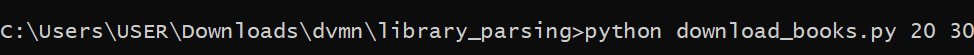

# Парсер книг с сайта tululu.org

Скрипт позволяет скачать книги с сайта tululu.org в папку books, а также обложки книг в папку images.

### Как установить

Python3 должен быть уже установлен. 
Затем используйте `pip` (или `pip3`, есть конфликт с Python2) для установки зависимостей:
```
pip install -r requirements.txt
```

### Аргументы

Чтобы скрипт отработал правильно его нужно запустить с двумя числовыми параметрами, которые указывают диапазон скачиваемых с сайта книг.
Так, в примере ниже, скрип скачает книги с 21 по 30 включительно.



### Цель проекта

Код написан в образовательных целях на онлайн-курсе для веб-разработчиков [dvmn.org](https://dvmn.org/).